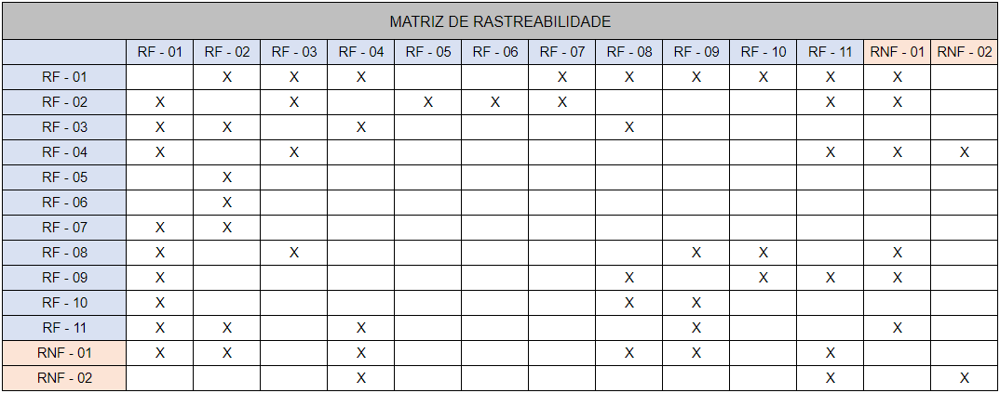

# Especificações do Projeto

Pré-requisitos: <a href="1-Documentação de Contexto.md"> Documentação de Contexto</a>

Definição do problema e ideia de solução a partir da perspectiva do usuário. É composta pela definição do  diagrama de personas, histórias de usuários, requisitos funcionais e não funcionais além das restrições do projeto.

Apresente uma visão geral do que será abordado nesta parte do documento, enumerando as técnicas e/ou ferramentas utilizadas para realizar a especificações do projeto

## Personas

**Maria Emília**
 
 
| Idade    |Ocupação  | Participação    | Motivações | Dificuldades | História |  
|:---------------|:------------------|:---------------------|:-----------------|:-----------------|:------------------------|
|57 anos |Analista de TI |Projetos de softwares |Promover a transformação digital.| Bater e registrar os pontos de horários| Existem muitas dificuldades e bugs nesses aplicativos de pontos web.|

**Jéssica Santos**

| Idade    |Ocupação  | Participação    | Motivações | Dificuldades | História |  
|:---------------|:------------------|:---------------------|:-----------------|:-----------------|:------------------------|
|27 anos. |Gerente de Contas. |Gerenciar custos de uma empresa. | Organizar e facilitar a vida da empresa e funcionarios.| Controlar seus horarios extras através dos pontos digitais.|Não consegue organizar sua agenda e saber quantas horas extras foram executadas.|

**Rafael Rodrigues**

| Idade    |Ocupação  | Participação    | Motivações | Dificuldades | História |  
|:---------------|:------------------|:---------------------|:-----------------|:-----------------|:------------------------|
|42 anos |Contador. |Contador em uma empresa de vendas. | Cuidar e gerenciar os orçamentos e lucros da empresa.| Visualizar e planejar suas horas contratadas e extras.| Visualizar e conseguir ter acesso aos pontos que foram registrados, com horario, data e local.|

**Nicolas Ardigo**

| Idade    |Ocupação  | Participação    | Motivações | Dificuldades | História |  
|:---------------|:------------------|:---------------------|:-----------------|:-----------------|:------------------------|
|22 anos |Rh. | Integrante da equipe de rh de uma empresa. | Gerenciar as pessoas que serão e são contratadas.| Visualizar as horas dos funcionários.| Visualizar e conseguir ter acesso aos pontos que foram registrados, de cada funcionário.|

## Histórias de Usuários

Com base na análise das personas forma identificadas as seguintes histórias de usuários:

|EU COMO... `PERSONA`| QUERO/PRECISO ... `FUNCIONALIDADE` |PARA ... `MOTIVO/VALOR`                 |
|--------------------|------------------------------------|----------------------------------------|
|Maria Emília        | Um aplicativo mobile que seja estável e simples. | Para que facilite a rotina de pontos diárias. |
|Maria Emília        | Um aplicativo mobile que possua mais funções pertinentes alem do ponto. | Para aumentar a possibilidade e praticidade do trabalho no dia a dia. |
|Maria Emília        | Um aplicativo mobile que registra de fato os pontos sem bugs ou delays . | Para que não atrase ou gere informações duplicadas ou erradas. |
|Jessica Santos      | Uma funcionalidade para controlar minhas horas extras.   | Para que possa gerenciar minhas horas no banco ou de trabalho.|
|Rafael Rodrigues    | Uma funcionalidade em que possa visualizar os pontos registrados com informações pertinentes. | Para que possa planejar, entender e justificar meus horários |
|Rafael Rodrigues    |Acesso simples e direto ao ponto contendo data, hora e local em que foi batido. | Para controlar meinhas batidas de pontos diárias. |
|Nicolas Ardigo    |Acesso simples e direto ao ponto de todos funcionarios registrados. | Para conseguir gerenciar melhor as horas trabalhadas de cada funcionário. |

## Modelagem do Processo de Negócio 

### Análise da Situação Atual

Várias empresas  possuem alguns  relacionados ao registro de horas trabalhadas por seus funcionários. Isso se deve ao uso de sistemas ineficazes ou a completa falta de uma ferramenta digital para esa tarefa. O registro de ponto eletrônico através de uma aplicação móvel permite com que as empresas realizem um controle mais efetivo do desempenho de seus funcionários, alem de permitir que estes também possam registrar sua atiidade de forma rápida e fácil e acompanhar seus respectivos bancos de horas.
### Descrição Geral da Proposta

A solução proposta é sistema via aplicativo para registro de horas trabalhadas, que permita um controle por parte das empresas e de seus funcionários dos registros de ponto.

### Processo 1 – CADASTRO DE COLABORADORES

O Admin poderá realizar login do aplicativo e fazer o cadastro da uma empresa e colaboradores.

### Processo 2 – REGISTRO DE PONTO

Este processo permite o Funcionário da empresa faça login e registre o seu ponto via aplicativo.

### Processo 3 – MOSTRAR HISTÓRICO DE PONTO

 Permite que o funcionário visualize todos os seus registros de pontos anteriormente.

## Indicadores de Desempenho

Apresente aqui os principais indicadores de desempenho e algumas metas para o processo. Atenção: as informações necessárias para gerar os indicadores devem estar contempladas no diagrama de classe. Colocar no mínimo 5 indicadores. 

## Requisitos

As tabelas que se seguem apresentam os requisitos funcionais e não funcionais que detalham o escopo do projeto. Para determinar a prioridade de requisitos, aplicar uma técnica de priorização de requisitos e detalhar como a técnica foi aplicada.

### Requisitos Funcionais

| ID |	Descrição do Requisito	| Prioridade |
|---|---|:-:|
| RF-001	| A aplicação deve permitir a realização de cadastro, login, edição e exclusão de perfil de empresa.| 	ALTA |
| RF-002	| A aplicação deve permitir a realização de cadastro, login, edição e exclusão de perfil de funcionário.| 	ALTA |
| RF-003	| A aplicação deve permitir o registro e visualização de entrada e saída de funcionários. |	ALTA |
| RF-004	| A aplicação deve permitir a geração de relatórios de histórico de ponto.	| MÉDIA | 
| RF-005	| A aplicação deve permitir a edição de registros de ponto por parte da empresa. |	MÉDIA |
| RF-006	| A aplicação deve oferecer a funcionalidade de gerenciamento de permissões.	| MÉDIA | 
| RF-007	| A aplicação deve permitir a visualização do saldo de banco de horas	| MÉDIA |

### Requisitos não Funcionais

|ID     | Descrição do Requisito  |Prioridade |
|-------|-------------------------|----|
|RNF-001| O sistema deve ser responsivo para rodar em um dispositivos móvel | MÉDIA | 
|RNF-002| Deve ser estável durante o registro de pontos e utilização em geral pelo usuário |  MÉDIA | 
|RNF-003| A aplicação deve ter bom nível de contraste entre os elementos da tela em conformidade. | MÉDIA |

## Restrições

O projeto está restrito pelos itens apresentados na tabela a seguir.

|ID| Restrição                                             |
|--|-------------------------------------------------------|
|01| O projeto deverá ser entregue até o final do semestre |
|02| Não pode ser desenvolvido um módulo de backend        |

## Diagrama de Casos de Uso

O diagrama de casos de uso é o próximo passo após a elicitação de requisitos, que utiliza um modelo gráfico e uma tabela com as descrições sucintas dos casos de uso e dos atores. Ele contempla a fronteira do sistema e o detalhamento dos requisitos funcionais com a indicação dos atores, casos de uso e seus relacionamentos. 

# Matriz de Rastreabilidade

A matriz de rastreabilidade é uma ferramenta usada para facilitar a visualização dos relacionamento entre requisitos e outros artefatos ou objetos, permitindo a rastreabilidade entre os requisitos e os objetivos de negócio. 

# Gerenciamento de Projeto

De acordo com o PMBoK v6 as dez áreas que constituem os pilares para gerenciar projetos, e que caracterizam a multidisciplinaridade envolvida, são: Integração, Escopo, Cronograma (Tempo), Custos, Qualidade, Recursos, Comunicações, Riscos, Aquisições, Partes Interessadas. Para desenvolver projetos um profissional deve se preocupar em gerenciar todas essas dez áreas. Elas se complementam e se relacionam, de tal forma que não se deve apenas examinar uma área de forma estanque. É preciso considerar, por exemplo, que as áreas de Escopo, Cronograma e Custos estão muito relacionadas. Assim, se eu amplio o escopo de um projeto eu posso afetar seu cronograma e seus custos.

## Gerenciamento de Tempo

O gráfico de Gantt ou diagrama de Gantt também é uma ferramenta visual utilizada para controlar e gerenciar o cronograma de atividades de um projeto. Com ele, é possível listar tudo que precisa ser feito para colocar o projeto em prática, dividir em atividades e estimar o tempo necessário para executá-las.

## Gerenciamento de Equipe

O gerenciamento adequado de tarefas contribuirá para que o projeto alcance altos níveis de produtividade. Por isso, é fundamental que ocorra a gestão de tarefas e de pessoas, de modo que os times envolvidos no projeto possam ser facilmente gerenciados. 

## Gestão de Orçamento

O processo de determinar o orçamento do projeto é uma tarefa que depende, além dos produtos (saídas) dos processos anteriores do gerenciamento de custos, também de produtos oferecidos por outros processos de gerenciamento, como o escopo e o tempo.

